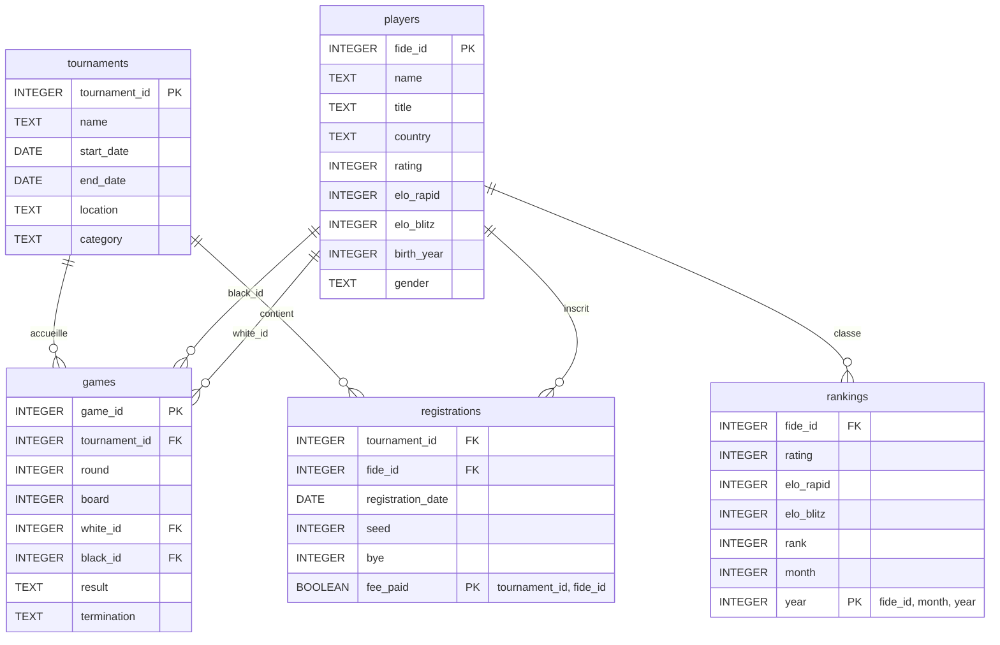

# Base de données FIDE – Document de conception 

> **Projet Universitaire SQL** - *HERWEDE NOAH* (DS2E-M1) – dépôt : [https://github.com/N-Herwede/SQL-FIDE](https://github.com/N-Herwede/SQL-FIDE)

## Source des données
Les données originales viennent du site officiel de la FIDE  :https://ratings.fide.com . Nous avons téléchargé le classement complet puis retenu un échantillon de cinq cents joueurs, hommes et femmes, couvrant les trois cadences classique, rapide et blitz. Les fichiers FIDE_Mars_2025.csv et FIDE_Avril_2025.csv rassemblent leurs valeurs Elo.

Par la suite un modèle LLM est utilisé pour génerer des tournois et des parties fictives. Notamment les fichiers Tournaments.csv et Games.csv. Les classements mensuels Rankings_Mars.csv et Rankings_Avril.csv ont été calculés à partir de ces parties simulées, en suivant la méthodologie d’évaluation Elo de la FIDE également trouvable sur le site pour avoir un tableau porpre prêt a l'analyse.

## Objectif & portée

Le projet vise à reconstruire une version réduite de la base de données de la Fédération Internationale des Échecs. La base conserve l'historique mensuel des valeurs Elo, gère les tournois homologués ainsi que leurs inscriptions, enregistre les parties après vérification des inscriptions et fournit des tableaux ou des vues pour visualiser les classements, statistiques et performances des joueurs. Pour celui ci on utilise donc Sqlite3 et et la fonctionalité Codescpace de Github.

## Choix de conception
 Le point de départ a été le numéro FIDE, comme il identifie déjà chaque joueur dans le monde entier, il nous servira sert naturellement de clé primaire par exemple dans la table players. Les tournois, eux, n’ont pas d’identifiant universel ou d'id sur le site de la Fide et les ayant générer par LLM, nous avons donc créé notre propre ID , un entier auto‑incrémenté.

Pour conserver l’évolution des Elo sans perdre d'information et garder un  historique, nous stockons chaque données mensuel dans la table rankings. Un déclencheur recopie automatiquement la valeur la plus récente dans la colonne rating de players, ce qui évite de recalculer le classement actuel à chaque requête tout en gardant la trace des mois précédents.

La table "registrations" fait le lien entre joueurs et tournois ,  elle précise la date d’inscription, le numéro de départ , les éventuels byes et le paiement des droits d’entrée. En plus de cela la cohérence sportive est protégée par un autre déclencheur , avant d’enregistrer une partie, il vérifie que les deux adversaires figurent bien parmi les inscrits du tournoi. S’il manque une inscription, l’insertion est bloquée. Avec ce system aucune partie  hors compétition et donc non soumis a l'elo et norme fide ne peut se glisser dans la base par erreur.

Pour faciliter la maintenance, toutes les clés étrangères sont réglées sur "ON DELETE CASCADE". C'est a dire que supprimer un tournoi efface d’un coup ses inscriptions et ses parties, ce qui garantit qu’aucune ligne orpheline ne traîne après nettoyage dans la base de données.

Enfin, nous avons  les calculs récurrents dans SQL_Query dans des view telles que v_tournament_standings ou v_recent_form. Ces vues servent de raccourcis et évitent de répéter des jointures complexes et rendent l’analyse facile.

## Description des entités

| Table | Rôle / contenu | Colonnes essentielles | Particularités et contraintes |
|-------|----------------|------------------------|--------------------------------|
| **players** | Répertoire principal des joueuses et joueurs | `fide_id` (PK), `name`, `title`, `country`, `rating`, `elo_rapid`, `elo_blitz`, `birth_year`, `gender` | `fide_id` correspond au numéro officiel ; un index sur `country` accélère les statistiques par nation. La colonne `rating` est mise à jour par trigger à partir de **rankings**. |
| **tournaments** | Métadonnées des compétitions | `tournament_id` (PK), `name`, `city`, `country`, `start_date`, `end_date` | `tournament_id` est une clé artificielle auto‑incrémentée, plus robuste qu’une clé naturelle fondée sur le couple ville + dates. |
| **registrations** | Table d’association joueur‑tournoi | `tournament_id` (FK), `fide_id` (FK), `registration_date`, `seed`, `bye`, `fee_paid` | Clé primaire composée `(tournament_id, fide_id)`. Stocke la place de départ (seed), les exemptions de ronde (bye) et le paiement des droits d’entrée. |
| **games** | Parties individuelles | `game_id` (PK), `tournament_id` (FK), `round`, `white_id` (FK), `black_id` (FK), `result`, `pgn` | Le déclencheur `trg_game_registration_check` bloque l’insertion si l’un des deux joueurs n’est pas inscrit dans **registrations** pour ce tournoi. |
| **rankings** | Historique mensuel des Elo | `fide_id` (FK), `rating`, `rank`, `month`, `year` | Clé primaire composée `(fide_id, month, year)` interdisant les doublons. Le trigger `trg_update_player_rating` pousse la dernière valeur vers **players.rating**. |

##  Diagramme Entité‑Relation (en mermaid)

Le schéma comprend cinq entités principales : players, tournaments, registrations, games et rankings. 

## 4. Contraintes & intégrité

| Mécanisme                                                                                       | Raison                                                                                              |
| ----------------------------------------------------------------------------------------------- | --------------------------------------------------------------------------------------------------- |
| FK avec **`ON DELETE CASCADE`** sur `games` & `registrations` → `players`/`tournaments` | simplifie le nettoyage (ex. suppression d’un tournoi) tout en évitant des orphelins.                |
| Trigger **`trg_game_registration_check`**                                               | empêche d’ajouter une partie si l’un des deux joueurs n’est pas inscrit au tournoi.                 |
| Check sur **`games.result`**                                                            | autorise uniquement `'1-0'`, `'0-1'`, `'1/2-1/2'`.                                                  |
| Trigger **`trg_update_player_rating`**                                                  | maintient la redondance contrôlée entre `rankings` (historique) et `players.rating` (vue actuelle). |

## Limites et pistes d'amélioration

La maquette joue bien son rôle de démonstration, mais elle reste simple. Le Elo n’est mis à jour qu’une fois par mois et après chaque partie, rien ne bouge, et on n'enregistre pas encore l’historique pour les cadences rapide et blitz. Les données se limitent à l’année 2025 pour le momment donc on ne peut  pas suivre la progression d’un joueur sur plusieurs saisons ni comparer des périodes différentes hormis les deux mois récupéré. Les parties ont été générées par un modèle de langue, donc elles ne reflètent pas  la réalité des statistiques et aucun contrôle ne signale encore l’import d’un même PGN en double.

La base de donnée ignore pour l’instant les changements de fédération, l’obtention de normes et l’évolution des titres. Les tournois fictifs n’ont pas de code officiel, ce qui complique l’interopérabilité avec d’autres catalogues. De plus, le calcul précis du gain ou de la perte d’Elo avec le coefficient K comme il est traditionellement calculer, se fait encore hors de SQLite.

#
Pour completer cette Base SQL on pourrait  intégrer par exemple le calcul Elo directement dans la base avec  un déclencheur déclenché après chaque partie qui ajusterait le rating, insérerait le nouveau cliché dans rankings et mettrait aussitôt à jour players.rating. Importer les archives FIDE sur une durée bien plus longue pourrait permettre  de vraies analyses de séries temporelles et ajouter une table federations et journaliser les changements de nationalité permettrait de mieux actualiser la base et refléter la réalité 

Enfin, un script python lancé chaque mois pourrait télécharger les nouveaux fichiers FIDE et déclencher automatiquement le pipeline d’import pour avoir une base actualisé automatiquement

## Mise en œuvre

- Créer les tables avec la commande & Charger les données avec 
- "sqlite3 Fide_chess.db < SQL_Load_Script_Schema.sql." 
- La base peut être utilisée pour insérer un nouveau tournoi etc..
- Ou encore activer les vues et les déclencheurs avec sqlite3  dans SQL_Query 

---

*Document rédigé en Markdown &  diagramme Mermaid 